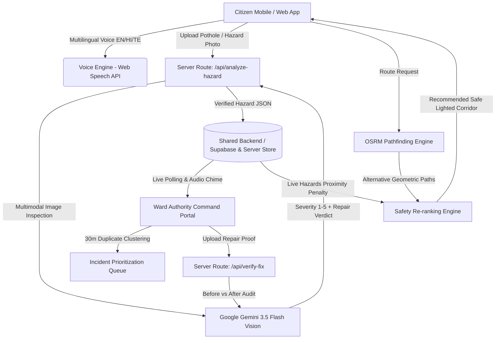

# Raastha (रास्ता) 🛣️
> **Voice-First Civic Safety & Safe Corridor Navigation Platform**  
> *Report road hazards with voice or camera, navigate streetlit corridors, and auto-dispatch municipal repair units with exposure-weighted prioritization.*

---

## ⚡ The One-Line Pitch
Raastha empowers citizens to report street hazards in seconds using multilingual voice or photos evaluated by Google Gemini Vision, navigates pedestrians along streetlit corridors using OSRM, and routes municipal response crews via an exposure-weighted priority queue.

---

## 🏗️ System Architecture



---

## ✨ Core Features & Technical Implementation

### 1. Gemini AI Hazard Vision Inspector
- **Severity Estimation (Levels 1–5)**: Instead of claiming impossible single-photo depth measurement, Gemini estimates surface defect severity, commuters at risk, and whether the hazard strictly requires municipal repair (`needsFixing: boolean`).
- **Zero-Crash Fallback**: Includes immediate manual severity override buttons (Levels 1–5) and intelligent civil engineering heuristics if the API key is absent or network is degraded.

### 2. OSRM Dynamic Routing & Safety Re-ranking
- Computes real-time geometric routes between GPS coordinates using the Open Source Routing Machine (OSRM) driving/walking engine.
- **Safety Re-Ranking Formula**:
  $$\text{Safety Score} = 95 - \sum (\text{Severity}_i \times 5) \quad \text{for hazards within 60m of route}$$
- Generates turn-by-turn directions and audible voice guidance.

### 3. Ward Authority Queue & 30m Duplicate Clustering
- **30-Meter Proximity Clustering**: If a citizen reports a hazard within 30 meters of an existing active incident of the same type, Raastha clusters it into a single ticket, increments confirmation count, and recalculates commuter exposure.
- **Exposure Priority Formula**:
  $$\text{Priority Score} = \frac{\text{Severity (1–5)} \times \text{Daily Commuter Exposure Proxy}}{100}$$
- **Real-Time Notifications**: When a new Level 4 or 5 hazard is detected, the authority dashboard triggers an audible Web Audio chime, toast banner, and red alert badge.

### 4. AI Before vs After Fix Verification
- When municipal contractors complete roadwork, authorities upload an "After" photo.
- Gemini Vision audits the before-and-after pair to verify asphalt leveling and compaction before closing the ticket.

### 5. Mobile Emergency SOS Broadcast
- Real-time GPS coordinate lock.
- Instant dispatch via **WhatsApp deep link**, **SMS URI (`sms:?body=...`)**, **Web Share API (`navigator.share`)**, and direct one-tap call to **112 / 1091**.

---

## 📊 Honest Scope & Limitations

| Feature | Current Implementation | Honest Production Scope |
| :--- | :--- | :--- |
| **Hazard Severity** | Gemini estimates visual severity (1–5) based on surface cavitation and rubble spread. | Single-photo depth estimation is an approximation; lidar/depth sensors would be needed for millimeter depth. |
| **Daily Commuters** | Estimated from Raastha route requests passing within ~30m in the last 24h + road class baseline proxy. | Logs anonymous corridor queries in route_requests table without user identity. |
| **Routing & Safety** | OpenRouteService multi-route alternatives evaluated against active hazard reports in lib/safety.ts. | Real ORS turn-by-turn guidance, straight-line fallback with sampling every ~25m and ~30m hazard proximity detection. |
| **Voice Engine** | Web Speech API with automatic typed search fallback for unsupported browsers. | Native Android/iOS apps would embed on-device whisper models for offline multilingual recognition. |
| **Backend Sync** | Dual-tier: Supabase client ready, backed by a persistent multi-device server store. | Works out-of-the-box on local dev and Vercel without mandatory Supabase provisioning. |

---

## 🚀 Quickstart & Demo Script

### 1. Installation
```bash
git clone https://github.com/UjjwalShreyas/raastha.git
cd raastha
npm install
```

### 2. Environment Variables
Copy `.env.example` to `.env.local`:
```bash
cp .env.example .env.local
```

Add your Google Gemini API key:
```env
GEMINI_API_KEY=your_gemini_api_key_here
```

### 3. Launch Development Server
```bash
npm run dev
```
Open [http://localhost:3000](http://localhost:3000).

---

## 🎭 1-Minute Judge Demo Script

1. **Citizen Home (`/`)**:
   - Tap the microphone button or type a voice prompt in Hindi, Telugu, or English.
   - Observe the streamlined 3-button citizen layout (Report, Safe Route, My Reports).
2. **Hazard Reporter (`/report`)**:
   - Click **"Test Demo Pothole"** (or upload any road photo).
   - Watch Gemini Vision diagnose cavity depth, return **Severity 4/5**, mark **"Strictly Needs Fixing"**, and preview the manual override controls.
   - Submit report.
3. **Safe Corridor Navigation (`/route`)**:
   - Select destination.
   - View live OSRM routes comparing the **Safe Illuminated Corridor (Safety: 94/100)** vs **Shortcut (Safety: 68/100)** with turn-by-turn guidance.
4. **Ward Command Dashboard (`/admin`)**:
   - Open `/admin` in a new tab.
   - Notice the exposure-weighted priority queue, live audio chime, 30m duplicate clustering badge, and test the **"Verify & Resolve Fix with AI"** modal.
