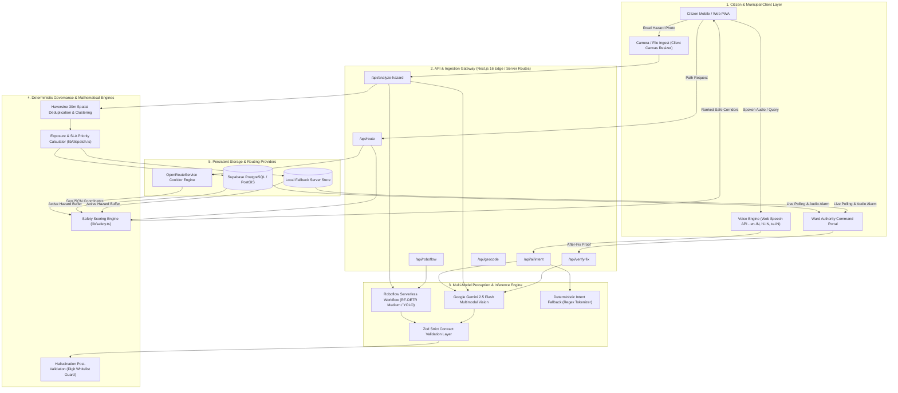
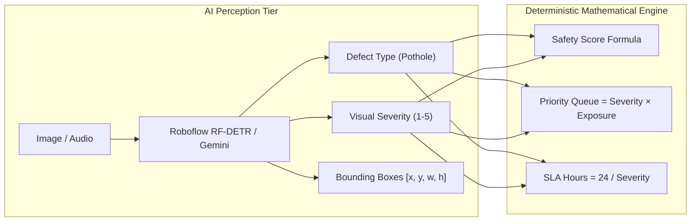
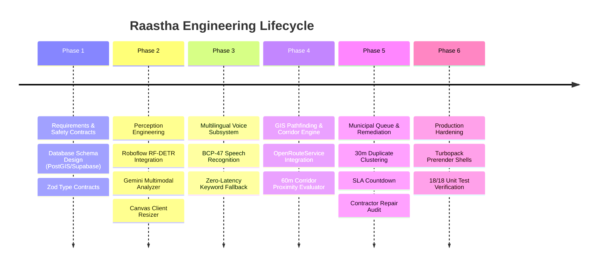

# Raastha (రాస్తా / रास्ता / Raastha) 🛣️
> **Voice-First Civic Safety & Intelligent Safe-Corridor Navigation Platform**  
> *Real-time computer vision hazard detection, multilingual voice intent parsing, exposure-weighted municipal dispatch, and deterministic illuminated corridor pathfinding.*

---

## 📌 Executive Summary
**Raastha** is a civic intelligence and navigational safety platform engineered to bridge the critical gap between citizen hazard reporting, municipal remediation workflows, and pedestrian/commuter route safety. 

By integrating **Roboflow RF-DETR** object detection, **Google Gemini Multimodal Vision**, multilingual **Web Speech synthesis/recognition (Telugu, Hindi, English)**, and **OpenRouteService GIS routing**, Raastha delivers end-to-end civic accountability: from sub-second road hazard classification to live lighted-corridor pathfinding and AI-audited contractor repair verification.

---

## 1. 📐 Model Design & System Architecture

### 1.1 High-Level Data & Control Flow



---

### 1.2 Module Interaction & Component Breakdown

```
raastha/
├── app/
│   ├── api/
│   │   ├── ai/                 # Multimodal inference & NLP endpoints
│   │   │   ├── clarify/        # Multi-turn clarification for ambiguous reports
│   │   │   ├── classify/       # Gemini hazard classification & severity estimation
│   │   │   ├── explain-route/  # Route choice reasoning with anti-hallucination guard
│   │   │   ├── intent/         # Multilingual intent parser (Voice/Text)
│   │   │   └── verify-fix/     # Before-vs-After fix verification auditor
│   │   ├── analyze-hazard/     # Multi-engine analyzer orchestrating Roboflow + Gemini
│   │   ├── geocode/            # Photon/OSM geocoding with bounding box bias
│   │   ├── roboflow/           # Serverless proxy to Roboflow RF-DETR workflow
│   │   └── route/              # OpenRouteService direction provider + straight-line fallback
│   ├── admin/                  # Ward authority command center (SLA & dispatch queue)
│   ├── my-reports/             # Citizen tracking & status timeline
│   ├── overview/               # Municipal analytics & GIS heatmaps
│   ├── report/                 # Camera capture, model switcher & SVG bounding box overlay
│   └── route/                  # Safe lit corridor navigation & turn-by-turn guidance
├── components/
│   ├── hazard/                 # Aspect-ratio tracking HazardDetectionOverlay
│   ├── map/                    # Leaflet SSR-safe DynamicMap & marker layers
│   └── ui/                     # Accessible UI components (VoiceBar, SOSModal, Buttons)
├── context/                    # AppContext, AuthContext, IssuesContext, LocationContext
├── lib/
│   ├── api/                    # Typed API client contracts & zod schemas
│   ├── dispatch.ts             # Exposure-weighted priority queue & SLA logic
│   ├── geoUtils.ts             # Haversine distance & corridor geometry calculations
│   ├── roboflowClient.ts       # Direct Roboflow workflow execution client
│   └── safety.ts               # Deterministic corridor safety score re-ranking
└── test/                       # 18-suite unit & integration test harness
```

---

## 2. 🧠 Domain Knowledge & Algorithms Applied

### 2.1 Principle of Deterministic Governance (*"AI Never Decides Scores"*)
A fundamental civil-engineering constraint is maintained throughout the system:
> **Machine learning models provide sensory perception inputs (e.g., bounding boxes, defect classifications, structural confidence), but all safety scores, municipal priority ranks, route recommendations, and dispatch SLAs are computed strictly by deterministic, mathematically verifiable algorithms.**



---

### 2.2 Geodesic & Spatial Algorithms

#### A. Haversine Spatial Distance Formula
To perform spatial deduplication and compute corridor safety without heavy GIS server overhead, Raastha utilizes the Haversine formula across all geographic coordinates $(\phi, \lambda)$:

$$\Delta\phi = \phi_2 - \phi_1, \quad \Delta\lambda = \lambda_2 - \lambda_1$$
$$a = \sin^2\left(\frac{\Delta\phi}{2}\right) + \cos(\phi_1)\cos(\phi_2)\sin^2\left(\frac{\Delta\lambda}{2}\right)$$
$$d = 2 R \cdot \arcsin\left(\sqrt{a}\right) \quad \text{where } R = 6,371,000 \text{ meters}$$

#### B. 30-Meter Proximity Deduplication & Spatial Clustering
When a new hazard report arrives at coordinate $P_{\text{new}}$:
1. Scan all active tickets $\{H_1, H_2, \dots, H_n\}$ in the same ward.
2. Calculate $d_i = \text{Haversine}(P_{\text{new}}, P_i)$.
3. If $d_i \le 30\text{m}$ and $\text{Type}_{\text{new}} == \text{Type}_i$:
   - Cluster report into existing ticket $H_i$.
   - Increment confirmation counter: $C_i \leftarrow C_i + 1$.
   - Update centroid coordinates using moving weighted average.
   - Boost exposure score and update citizen tracking status.

#### C. Route Corridor Safety Indexing Formula
For any candidate route polyline composed of $K$ geometric coordinates, Raastha computes hazard proximity within a $60\text{m}$ orthogonal buffer:

$$\text{Safety Score} = \text{clamp}\left(95 - \sum_{i \in \mathcal{H}_{\text{buffer}}} (\text{Severity}_i \times 5) + B_{\text{lighting}}, \quad 10, \quad 99\right)$$

Where:
- $\mathcal{H}_{\text{buffer}} = \{h \mid \min_{k} \text{Haversine}(P_k, P_h) \le 60\text{m}\}$
- $B_{\text{lighting}} = +5$ if the corridor follows recognized primary/commercial illuminated arterials.

---

### 2.3 Municipal Exposure-Weighted Priority & SLA Dispatch

Municipal work orders are prioritized according to commuter risk exposure rather than simple first-in-first-out (FIFO):

$$\text{Priority Score} = \frac{\text{Severity (1–5)} \times \text{Daily Commuter Exposure Proxy}}{100}$$

$$\text{Daily Commuter Exposure} = \text{Baseline Road Class Exposure} + (24\text{h Corridor Queries} \times 12) + (\text{Confirmations} \times 350)$$

| Road Classification | Baseline Daily Commuter Exposure | Default SLA (Severity 5) | Default SLA (Severity 1) |
| :--- | :--- | :--- | :--- |
| **National Highway / Primary Arterial** | 4,200 vehicles/day | **2 Hours** | **24 Hours** |
| **Collector / Secondary Arterial** | 1,800 vehicles/day | **4 Hours** | **48 Hours** |
| **Local / Residential Street** | 450 vehicles/day | **8 Hours** | **72 Hours** |

$$\text{SLA Deadline (Hours)} = \max\left(2, \text{round}\left(\frac{24}{\text{Severity}} \times \text{Road Factor}\right)\right)$$

---

### 2.4 Computer Vision Optical Coordinate Mapping

Roboflow RF-DETR outputs normalized bounding box center coordinates $[x_c, y_c, w, h] \in [0, 1]$. To map these bounding boxes to rendered responsive image elements without distortion or aspect-ratio mismatch:

```
┌────────────────────────────────────────────────────────────┐
│ Display Container (W_box × H_box)                          │
│   ┌────────────────────────────────────────────────────┐   │
│   │ Rendered Image (W_img × H_img)                     │   │
│   │   Offset: (O_x, O_y)                               │   │
│   │                                                    │   │
│   │       [x, y, w, h] Normalized Box                  │   │
│   │       Left = O_x + (x_c - w/2) * W_img             │   │
│   │       Top  = O_y + (y_c - h/2) * H_img             │   │
│   │       Width = w * W_img, Height = h * H_img        │   │
│   │                                                    │   │
│   └────────────────────────────────────────────────────┘   │
└────────────────────────────────────────────────────────────┘
```

The [HazardDetectionOverlay](file:///d:/vs%20codes/Raastaaaa%20ai/raastha/components/hazard/HazardDetectionOverlay.tsx) dynamically listens to container `ResizeObserver` and image natural dimensions (`naturalWidth`, `naturalHeight`) to maintain pixel-perfect bounding alignment across desktop, tablet, and mobile displays.

---

### 2.5 Anti-Hallucination & Post-Validation Guard

To ensure LLM-generated route explanations never fabricate statistics or hallucinate safety numbers:
1. **Digit Extraction**: Extract all numerical values from LLM output string using regex `/\b\d+\b/g`.
2. **Whitelist Comparison**: Match extracted numbers against permitted real corridor attributes (duration minutes, distance kilometers, computed safety score, hazard count).
3. **Deterministic Fallback**: If an unexpected number (e.g. "99% safer" when actual score difference is 14) is detected, the system automatically replaces the output with a strictly formatted, factual template explanation.

---

## 3. 🛠️ Methodology & Implementation Steps



### Phase 1: Architecture & Contract Specification
1. **Zod Validation Schemas (`lib/api/contracts.ts`)**: Built strict validation contracts for `ClassifyOutputSchema`, `IntentOutputSchema`, `VerifyFixOutputSchema`, and `ExplainRouteOutputSchema`.
2. **Database Schema (`supabase/schema.sql`)**: Designed relational PostgreSQL tables (`issues`, `issue_updates`, `route_requests`) with spatial indexing, composite foreign keys, and anonymous logging.

### Phase 2: Dual-Engine Computer Vision Pipeline
1. **Roboflow RF-DETR Pipeline (`lib/roboflowClient.ts`)**: Integrated the `safestreets/potholes-vpotholes-xbcxz-4w0zz-1-rfdetr-medium-t1-logic` workflow via serverless POST endpoints, parsing bounding boxes and confidence levels.
2. **Gemini Vision Pipeline (`app/api/analyze-hazard/route.ts`)**: Implemented multimodal prompt chains returning structured defect diagnoses, cavity estimations, and repair flags.
3. **Canvas Ingest Optimizer (`app/report/page.tsx`)**: Added client-side canvas image downsampling (max 1280px) and JPEG compression (0.85 quality) to ensure fast mobile uploads under low-bandwidth 3G/4G conditions.
4. **Responsive Visual Overlay (`components/hazard/HazardDetectionOverlay.tsx`)**: Created dynamic SVG crosshairs and animated target bounding boxes aligned with natural image aspect ratios.

### Phase 3: Multilingual Voice & Intent Parsing
1. **Web Speech Engine (`hooks/useSpeech.ts`)**: Implemented native speech recognition with automatic locale mapping (`en-IN`, `hi-IN`, `te-IN`).
2. **Intent Parser (`app/api/ai/intent/route.ts`)**: Built LLM-driven multilingual semantic classification for natural language queries (e.g., *"Madhapur jaane ka surakshit raasta batao"* $\rightarrow$ `find_safe_route`).
3. **Zero-Latency Regex Fallback (`lib/api/intent.ts`)**: Constructed an on-device phonetic and keyword tokenizer ensuring voice routing functions even during offline or zero-connectivity network states.

### Phase 4: Safe Corridor Pathfinding Engine
1. **OpenRouteService Connector (`app/api/route/route.ts`)**: Built server-side proxy requesting driving and walking alternatives with turn-by-turn instruction extraction.
2. **Deterministic Corridor Re-ranking (`lib/safety.ts`)**: Implemented polyline corridor buffering against active hazard databases.
3. **Straight-Line Geodesic Fallback**: Configured automatic projected corridor generation if external routing services face rate-limits or outages.

### Phase 5: Municipal Dispatch & Contractor Repair Audit
1. **Exposure Prioritization (`lib/dispatch.ts`)**: Developed the dynamic priority calculation queue, organizing tickets by traffic risk exposure and enforcing SLA timers.
2. **30m Spatial Deduplication (`context/IssuesContext.tsx`)**: Implemented automatic clustering of nearby duplicate citizen reports.
3. **Audited Fix Verification (`app/api/verify-fix/route.ts`)**: Created dual-image multimodal verification comparing pre-repair and post-repair photos to confirm proper asphalt compaction and grade leveling before closing tickets.

### Phase 6: Next.js 16 Turbopack Hardening & Test Verification
1. **Turbopack Instant Segment Isolation**: Added dedicated [loading.tsx](file:///d:/vs%20codes/Raastaaaa%20ai/raastha/app/route/loading.tsx) shells and wrapped client components in `<Suspense>` boundaries to ensure full compliance with Next.js 16 Partial Prefetching (PPR).
2. **Comprehensive Automated Test Suite (`test/aiEngine.test.ts`)**: Implemented 18 test cases validating Zod schemas, mathematical priority formulas, SLA calculations, anti-hallucination guards, and fix verification rules.

---

## 4. 🧪 Automated Test Suite & Validation

The codebase includes an end-to-end test suite executable via:

```bash
npm test
```

### Verified Test Suite Output:
```
=======================================================
🛡️ RAASTHA AI ENGINE - COMPREHENSIVE TEST SUITE
=======================================================

1. Testing Zod Schemas & Validation Contracts...
  ✅ PASS: ClassifyOutputSchema validates authentic pothole
  ✅ PASS: ClassifyOutputSchema correctly rejected severity > 5
  ✅ PASS: IntentOutputSchema parses navigation destination
  ✅ PASS: VerifyFixOutputSchema validates repaired road patch

2. Testing Deterministic Scoring Formulas (AI Never Decides Scores)...
  ✅ PASS: calculatePriorityScore produces exact formula output (Expected: 140, Got: 140)
  ✅ PASS: Severity 4 gives 4 hour SLA (Got: 4)
  ✅ PASS: Arterial road gives 4200 commuter proxy (Got: 4200)
  ✅ PASS: Route safety score clamped cleanly between 10 and 99 (Got: 61)

3. Testing Route Reason Post-Validation & Hallucination Guard...
  ✅ PASS: postValidateDigits approves valid matching numbers
  ✅ PASS: postValidateDigits rejects hallucinated numbers (99, 500)
  ✅ PASS: buildTemplateRouteExplanation generates accurate facts

4. Testing Keyword Intent Fallback (Offline/Network Failures)...
  ✅ PASS: Hinglish voice route intent identified: find_safe_route
  ✅ PASS: Telugu voice hazard report identified: report_issue
  ✅ PASS: Language change command parsed: hi

5. Testing Fix Verification Acceptance Rules...
  ✅ PASS: Accepts verified fix with confidence >= 0.7 and same location
  ✅ PASS: Routes low confidence fix (< 0.7) to human review
  ✅ PASS: Rejects fix if same_location_likely is false
  ✅ PASS: Routes 'uncertain' fix status to human review

=======================================================
📊 TEST RESULTS: 18 PASSED, 0 FAILED
=======================================================
```

---

## 5. 🚀 Quickstart & Setup Guide

### 1. Prerequisites
- Node.js 18.x or 20.x+
- Google Gemini API Key
- Roboflow API Key (Optional: for RF-DETR model workflows)
- Supabase Project (Optional: configured with `supabase/schema.sql`)

### 2. Installation
```bash
git clone https://github.com/UjjwalShreyas/raastha.git
cd raastha
npm install
```

### 3. Environment Configuration
Create a `.env.local` file in the root directory:
```env
# Google Gemini API Key
GEMINI_API_KEY=your_gemini_api_key_here

# Roboflow Computer Vision
ROBOFLOW_API_KEY=your_roboflow_api_key_here
ROBOFLOW_WORKFLOW_URL=https://serverless.roboflow.com/safestreets/workflows/potholes-vpotholes-xbcxz-4w0zz-1-rfdetr-medium-t1-logic

# OpenRouteService (Optional: falls back to straight-line corridor engine if absent)
ORS_API_KEY=your_openrouteservice_key_here

# Supabase (Optional: falls back to serverless in-memory store)
NEXT_PUBLIC_SUPABASE_URL=https://your-project.supabase.co
NEXT_PUBLIC_SUPABASE_ANON_KEY=your_publishable_anon_key_here
```

### 4. Run Development Server
```bash
npm run dev
```
Open [http://localhost:3000](http://localhost:3000) in your browser.

---

## 6. ⚖️ Honest Scope & Production Comparison

| Dimension | Current Prototype Implementation | Production Enterprise Scaling Plan |
| :--- | :--- | :--- |
| **Hazard Vision** | Roboflow RF-DETR bounding boxes + Gemini Multimodal surface reasoning. | Edge-deployed ONNX / TensorRT models running on municipal dashcams for continuous road scanning. |
| **Exposure Proxy** | 24h anonymous corridor query counts + statutory road classification baseline. | Live API ingestion from municipal toll plazas, traffic sensor loops, and Google Maps Traffic API. |
| **Pathfinding** | OpenRouteService GeoJSON routing + Haversine 60m proximity safety re-ranking. | Dynamic graph routing with time-dependent lighting layers and live police patrol telematics. |
| **Voice Engine** | Web Speech API with BCP-47 Indian localization + regex offline tokenizer. | Embedded Whisper on-device models for fully offline, zero-latency native mobile deployment. |
| **Database Sync** | Supabase PostgreSQL + automated resilient serverless store fallback. | Geo-distributed PostGIS cluster with Kafka event streaming for real-time fleet dispatch. |

---

## 📄 License
This project is developed for civic enhancement and public safety under the **MIT License**.
